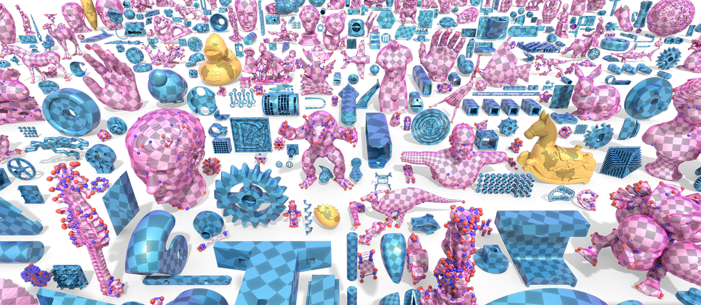
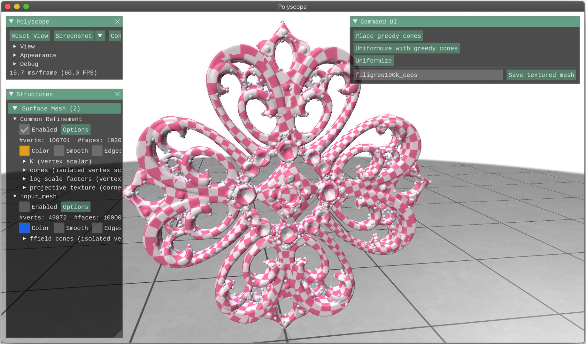
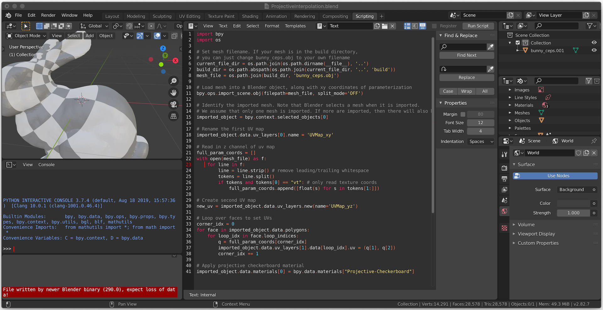
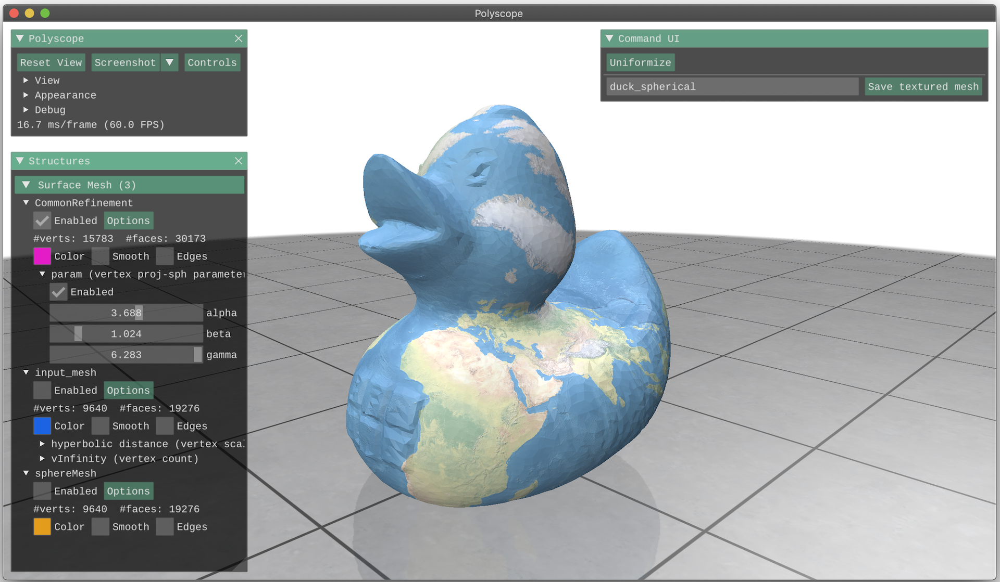
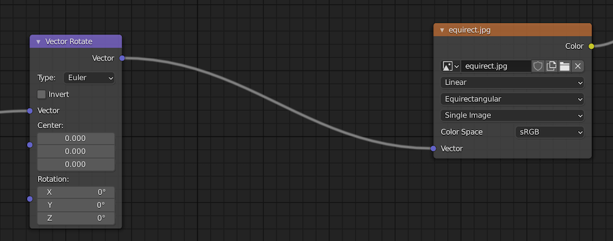

# Discrete Conformal Equivalence of Polyhedral Surfaces

C++ demo for "[Discrete Conformal Equivalence of Polyhedral Surfaces](http://www.cs.cmu.edu/~kmcrane/Projects/CEPS/index.html)" by [Mark Gillespie](https://www.markjgillespie.com), [Boris Springborn](http://page.math.tu-berlin.de/~springb/), and [Keenan Crane](http://www.cs.cmu.edu/~kmcrane/) at SIGGRAPH 2021.

PDF: [link](http://www.cs.cmu.edu/~kmcrane/Projects/CEPS/CEPS.pdf)  
Talk (20 minutes): [link](https://www.youtube.com/watch?v=wwuHFUQLlWA)  
Talk (5 minutes): [link](https://www.youtube.com/watch?v=W0iBHF5-r-M)



This algorithm takes as input a manifold surface mesh and produces parameterizations that are locally injective and discretely conformal in an exact sense. Unlike previous methods for discrete conformal parameterization, the method is guaranteed to work for any manifold triangle mesh, with no restrictions on triangulation quality or cone singularities. Stress tests involving difficult cone configurations and near-degenerate triangulations indicate that the method is extremely robust in practice, and provides high-quality interpolation even on meshes with poor elements.

If this code contributes to academic work, please cite as:
```bibtex
@article{Gillespie:2021:DCE,
                  author = {Gillespie, Mark and Springborn, Boris and Crane, Keenan},
                  title = {Discrete Conformal Equivalence of Polyhedral Surfaces},
                  journal = {ACM Trans. Graph.},
                  volume = {40},
                  number = {4},
                  year = {2021},
                  publisher = {ACM},
                  address = {New York, NY, USA}
}
```

##  Getting started
On mac/linux, you can set up this project with the following commands.
```bash
git clone --recursive https://github.com/MarkGillespie/CEPS.git
cd CEPS
mkdir build
cd build
cmake -DCMAKE_BUILD_TYPE=Release ..
make -j7
bin/parameterize /mesh/path.obj --viz
```
On Windows, Visual Studio can use the provided CMake files to build and run the project.

## Usage
You can parameterize meshes by running `bin/parameterize /path/to/mesh` executable. The input mesh must be manifold and connected.



The script takes a variety of arguments.

|flag | purpose|
| ------------- |-------------| 
|`--curvatures=curvatures.txt`| Specify curvatures (angle defects) at given vertices|
|`--scaleFactors=scaleFactors.txt`| Specify log scale factors at given vertices|
|`--ffield=a_mesh.ffield`| Use cones from an [MPZ](http://vcg.isti.cnr.it/Publications/2014/MPZ14/)-style cross field|
|`--greedyConeMaxU=5`| Maximum allowed log scale factor when placing cones (lower value = lower distortion in final parameterization, default value=5)|
|`--outputMeshFilename=a_mesh.obj`| File to save output mesh to, along with homogeneous texture coordinates|
|`--outputMatrixFilename=a_matrix.spmat`| File to save output interpolation matrix to |
|`--outputLogFilename=a_log.tsv`| File to save logs (timing + injectivty) to |
|`--useExactCones`| Do not lump together nearby cones in the ffield input, if any. Cones prescribed via `--curvatures` or `--scaleFactors` are never lumped|
|`--noFreeBoundary`| Do not impose minimal-area-distortion boundary conditions (useful, e.g. if prescribing polygonal boundary conditions with the `--curvatures` option)|
|`--viz`| Show the GUI |
|`--version`, `-v`| Version info |
|`--help`, `-h`| Display help |

### File formats
The input mesh may be an `obj`, `ply`, `off`, or `stl`.

Curvatures and scale factors should be given in text files where each line has a 0-indexed vertex index and a prescribed curvature/scale factor. Lines starting with `#` are ignored:
```
# A curvature file
0 1.57
36 3.14
12 -1.57
...
```
In the curvatures file, all vertices must be accompanied by a desired curvature. In the scale factors file, vertices may appear without any prescribed scale factor---such vertices are assigned a scale factor of 0.

The interpolation matrix is exported as a list of triplets. Explicitly, each line of the output file contains the row index, column index, and value of some entry of the matrix. These indices are 1-indexed to make it easy to load in  [Matlab](https://www.mathworks.com/help/matlab/ref/spconvert.html).

## Visualization
The `render/` directory contains a blender file (`ProjectiveInterpolation.blend`) that can load and visualize meshes that you parameterize. The blender file should open to a Python script in the `Scripting` workspace. You can load your own uniformized mesh by changing the mesh name in the script and clicking on `Run Script`. This will load your model and apply a correctly-interpolated checkerboard texture.



## Spherical uniformization



By default, this project only performs planar uniformization.

The spherical uniformization procedure requires [PETSc](https://petsc.org/), which can be installed from [here](https://petsc.org/release/install/install_tutorial/). During the installation process, PETSc should give you a `PETSC_ARCH` and `PETSC_DIR`. Once you have completed the installation, you can build the spherical uniformization code by running
```bash
cmake -DCMAKE_BUILD_TYPE=Release -DSPHERICAL_UNIFORMIZATION=ON -DPETSC_DIR=YOUR_PETSC_DIR -DPETSC_ARCH=YOUR_PETSC_ARCH ..
make -j7
```
(where `YOUR_PETSC_DIR` and `YOUR_PETSC_ARC` are whatever PETSc told you during installation).

Then you can spherically-uniformize meshes by running `bin/spherical_uniformize /path/to/mesh`.

|flag | purpose|
| ------------- |-------------| 
|`--outputMeshFilename=a_mesh.obj`| File to save output mesh to, along with its homogeneous spherical parameterization|
|`--outputMatrixFilename=a_matrix.spmat`| File to save output interpolation matrix to |
|`--outputLogFilename=a_log.tsv`| File to save logs (timing + injectivty) to |
|`--viz`| Show the GUI |
|`--version`, `-v`| Version info |
|`--help`, `-h`| Display help |

(Note that the output mesh file may not technically be a valid `obj` file, as we store texture coordinates with 4 components).

The world map here is from [Natural Earth](https://www.naturalearthdata.com/).

### Visualizing spherical uniformization
The output of `spherical_uniformize` can be loaded into blender in the `render/SphericalProjectiveInterpolation.blend` file. The texture can be rotated by going to the Shading tab, selecting the uniformized mesh, and adjusting the Euler angles on the `Vector Rotate` node. You can load another texture in the equirectangular projection in the environment texture node (currently labeled `equirect.jpg`).



## Test scripts
The `benchmark/` directory has test scripts that you can use to evaluate the performance of this code. For more details, see the [README in that directory](benchmark).
